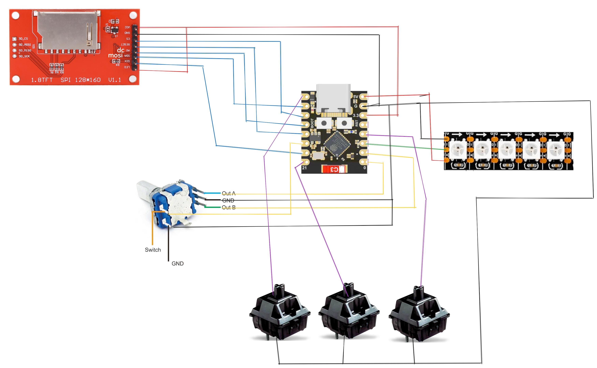
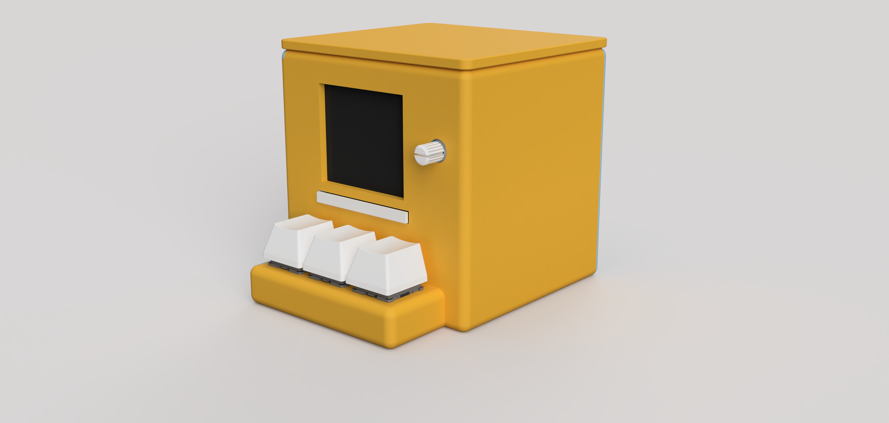

# DuckBeat!!!
### cute lil spotify display :3

DuckBeat is a tiny duck-themed spotify display powered by an ESP32  
It shows the currently playing track, album art, and playback status. Controlling it using switches and a rotary encoder

#### why i did it 
I wanted a tiny desk companion that displays my currently playing Spotify music in a fun and satisfying way with the switches.  
The duck-themed design is because i love ducks and i have a ton on my room lol

## stuff it haves/does

- displays current song on screen
- rotary knob for control
- mechanical buttons for playback
- RGB LED feedback
- custom 3D printed enclosure

## hardware

- ESP32-C3 SuperMini
- ST7735 1.8" SPI TFT display
- WS2812B LED strip
- EC11 rotary encoder
- 3x MX switches

## wiring

## render 

